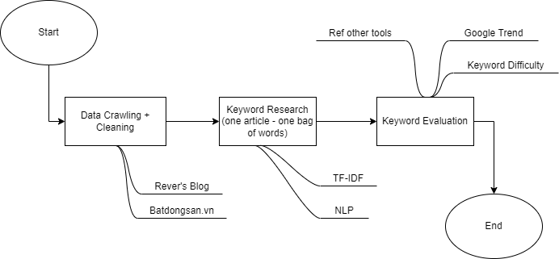

<div id="top"></div>

<!-- PROJECT LOGO -->
<br />
<div align="center">
  <a href="https://git.rever.vn/ai-hcmut/seo-keywords">
    
  </a>

  <h3 align="center">SEO Keywords</h3>

  <p align="center">
    <br />
    <a href="Readme.md"><strong>Explore the docs »</strong></a>
    <br />
    <br />
    <a href="https://git.rever.vn/ai-hcmut/seo-keywords">View Demo</a>
    ·
    <a href="https://git.rever.vn/ai-hcmut/seo-keywords/-/issues">Report Bug</a>
    ·
    <a href="https://git.rever.vn/ai-hcmut/seo-keywords/-/issues">Request Feature</a>
  </p>
</div>


<!-- TABLE OF CONTENTS -->
<details>
  <summary>Mục lục</summary>
  <ol>
    <li>
      <a href="#about-the-project">Thông tin dự án</a>
      <ul>
        <li><a href="#built-with"> Công nghệ sử dụng</a></li>
      </ul>
    </li>
    <li>
      <a href="#getting-started">Bắt đầu dự án</a>
      <ul>
        <li><a href="#prerequisites">Các thư viện sử dụng</a></li>
        <li><a href="#installation">Cài đặt</a></li>
      </ul>
    </li>
    <li><a href="#roadmap">Roadmap</a></li>
    <li><a href="#contributing">Contributing</a></li>
    <li><a href="#details">Details</a></li>
    <li><a href="#contact">Contact</a></li>
    <li><a href="#acknowledgments">Acknowledgments</a></li>
  </ol>
</details>


<!-- ABOUT THE PROJECT -->
## About The Project
Dự án phân tích keywords từ bên trang web đối thủ để đưa ra những keywords hợp lí phục vụ cho việc SEO trang web Rever.
Luồng thực thi của dự án:


<p align="right">(<a href="#top">back to top</a>)</p>


### Built With

Các công nghệ được sử dụng trong dự án gồm có:

* [Python](https://www.python.org/)
* [Google colab](https://colab.research.google.com/)
* [DataForSEO API](https://dataforseo.com/)

<p align="right">(<a href="#top">back to top</a>)</p>


<!-- GETTING STARTED -->
## Getting Started

### Prerequisites

Các thư viện được sử dụng
* bs4
  ```sh
  pip install bs4
  ```
*  pandas
  ```sh
   pip install pandas
  ```
*   multiprocessing
*   nltk
  ```sh
    pip install nltk
  ```
*   matplotlib
  ```sh
   pip install matplotlib
  ```
*   advertools
  ```sh
   pip install advertools
  ```
*   underthesea
  ```sh
   pip install underthesea
  ```
### Installation

Chúng ta có thể clone project này về và chạy trực tiếp


<!-- ROADMAP -->
## Roadmap

- [x] Crawl dữ liệu
- [x] Trích xuất dữ liệu
- [x] Phân tích keywords
  - [x] Sử dụng DataForSEO API
- [ ] Đưa ra suggest keywords cho một bài viết mới
- [ ] Phân tích keywords theo vị trí địa lí

<p align="right">(<a href="#top">back to top</a>)</p>

## Details
###  Crawl dữ liệu
**crawler.py**
```python 
  get_blog ( n_process , save = False )
```
* n_process: số process tạo ra
* save: lưu lại file csv. ('csv/blog_bdsvn.csv')

```python 
  get_BDS ( lim , n_process , save = False )
```
* lim: giới hạn lại số trang ở mỗi topic sẽ crawl
* n_process: số process tạo ra
* save: lưu lại file csv. ('csv/bds_bdsvn.csv')

Để chạy file:
```python 

import crawler as cl

if __name__ == '__main__':
    cl.get_BDS(10,4,True) # 10 page per topic, 4 process, save
    cl.get_blog(10,True)  # 10 process, save
```

**crawler-rever.py**
```python
def getHomePageInfo(pages,write=False):
```
###  Trích xuất keywords từ content 
**kw_extract.py**
```python
df = pd.read_csv("./csv/bds_bdsvn.csv")
```
Chỉnh sửa lại đường dẫn file csv cần phân tích để có thể trích xuất ra keyword theo ý muốn
File csv được lưu ở '/analysis_result/extract_result.csv'
###  Đánh giá keywords
**keyword_eval.py**
``` python
kw = [...]                  \\ Danh sách những keyword cần phân tích
trend = Evaluation(kw)      \\ Initialize
trend.getKeyWordTrend()     \\ Phân tích xu hướng keywords
trend.getRelatedQueries()   \\ Lấy những từ khóa liên quan (có thể sử dụng cho việc gợi ý từ khóa)
trend.keyword_difficulty()  \\ Phân tích độ cạnh tranh của keywords
print('Analysis Successful')

```
Keyword Difficulty trong DataForSeo API trả về 1 metric chỉ ra độ cạnh tranh của từ khóa để có thể
được rank trong top 10 kết quả organic cho keyword. Giá trị trong khoảng từ 1 tới 100, với 1 là dễ và
100 là cực khó.

Các dữ liệu sau khi được đánh giá sẽ được lưu vào '/analysis_result'

[Thông tin chi tiết về DataForSEO API](https://docs.dataforseo.com/v3/).

### Trực quan hóa
Để có thể trực quan hóa dữ liệu các thông tin có thể sử dụng Colab Notebook để chạy những file ipynb trong [colab](https://git.rever.vn/ai-hcmut/seo-keywords/-/tree/main/colab).
<!-- CONTACT -->
## Contact
* Email
  * Huỳnh Đại Vinh: vinh.huynhdavid2002@hcmut.edu.vn
  * Kha Sang: sang.khask12@hcmut.edu.vn

Project Link: [https://git.rever.vn/ai-hcmut/seo-keywords](https://git.rever.vn/ai-hcmut/seo-keywords)

<p align="right">(<a href="#top">back to top</a>)</p>
